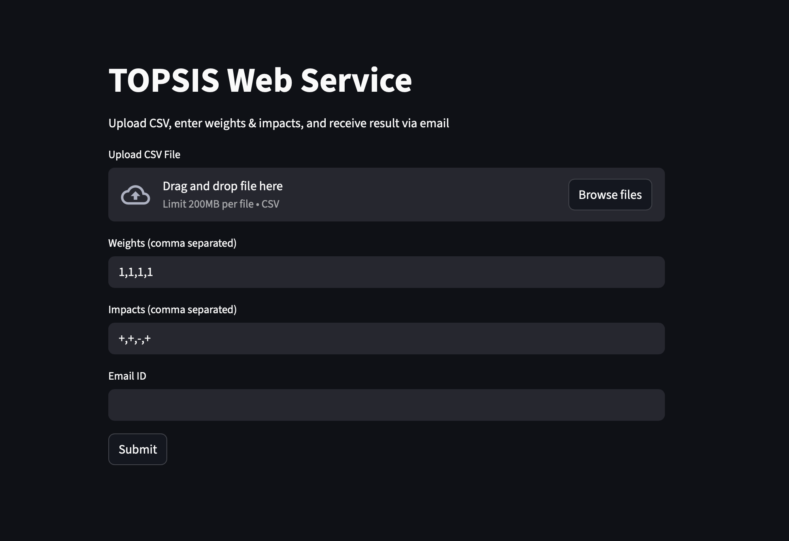

# TOPSIS Web Service (Part III)

This project is a **web-based implementation of the TOPSIS (Technique for Order Preference by Similarity to Ideal Solution)** method, developed as **Part III** of the assignment.

The application allows users to upload a CSV file, specify weights and impacts for criteria, and receive the TOPSIS result both on-screen and via **email**.

---

## 🌐 Live Application

👉 **Streamlit App Link:**  
https://topsis-web.streamlit.app

---

## 🖥️ User Interface

The web interface allows users to:

- Upload a CSV file
- Enter weights (comma-separated)
- Enter impacts (`+` or `-`, comma-separated)
- Provide an email ID to receive results

📸 **UI Screenshot:**  
(Add the screenshot image file in this folder and reference it below)

```md

```
